# Chat Server
## Tools
1. Python 3
2. Socket 
3. Thread 
4. Linux Operating System

## Description
* This chat application named "TCurah"
* There are a server and some clients
* Server has some features, i.e.:
  * Create an account
  * Login to account
  * Send personal message
  * Send broadcast message
  * Send group message and manage groups
  * Exit

## Testing
1. Run the `server.py` and `client.py` (make three until five clients to test).
   
   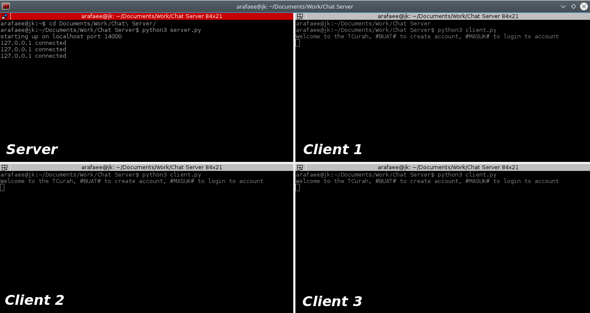

    Using five clients.

    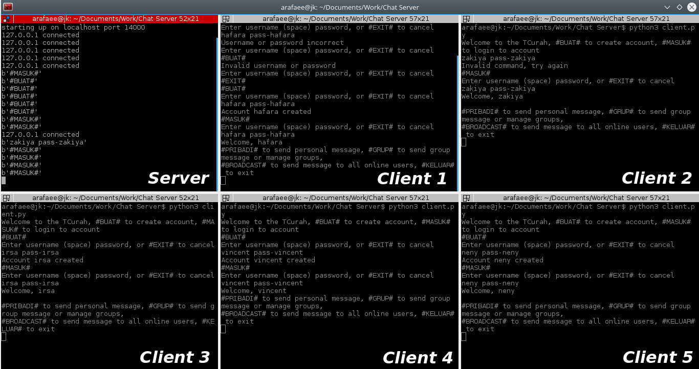

2. First, let's try to create an account using `#BUAT#` command. Then, enter the username and password.
   
   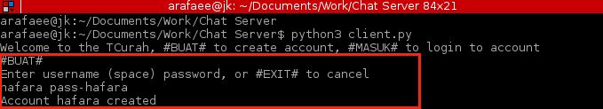

    If the username already exists, there will be a notification from the server.
    
    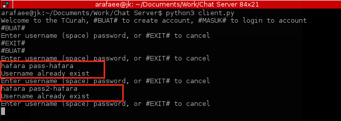

3. Second, let's try to login to an account using `#MASUK#` command. Then, enter the username and its password.
   
    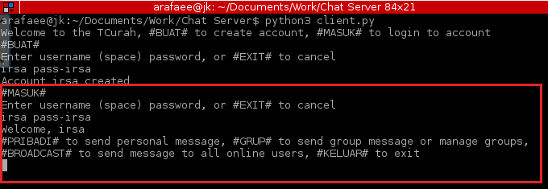
    
    If the username or password is incorrect or not match, there will be a notification from the server.

    

4. Third, let's try to use send personal message feature using `#PRIBADI#` message. First case, client 2 will send a personal message to client 3 and client 1 doesn't get the message.
   
    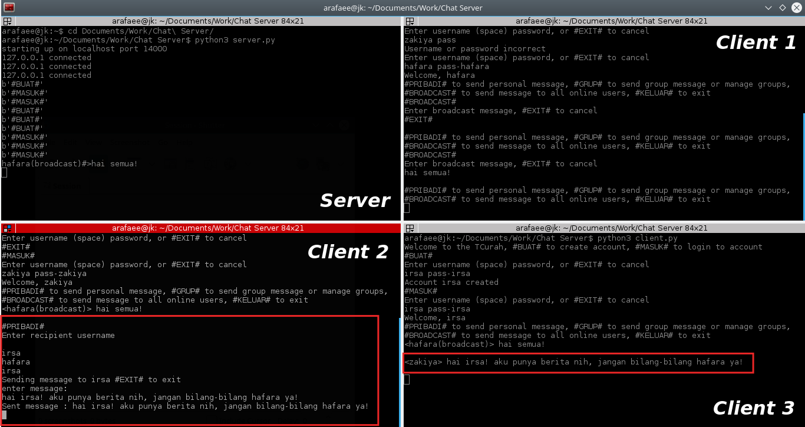

    Then, second case, client 1 will send a personal message to client 3 too.

    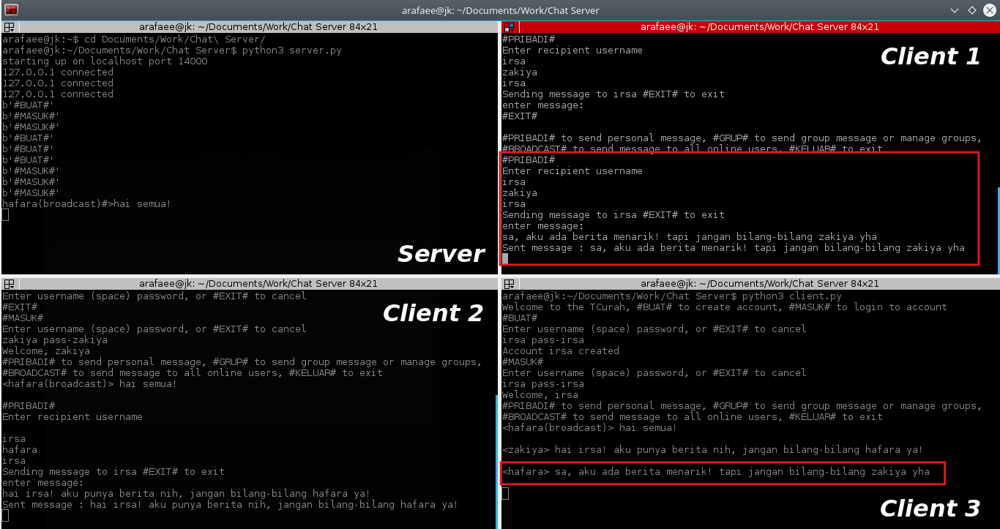

5. Fourth, we can also send a broadcast message to all online users using `#BROADCAST#` command.
    
    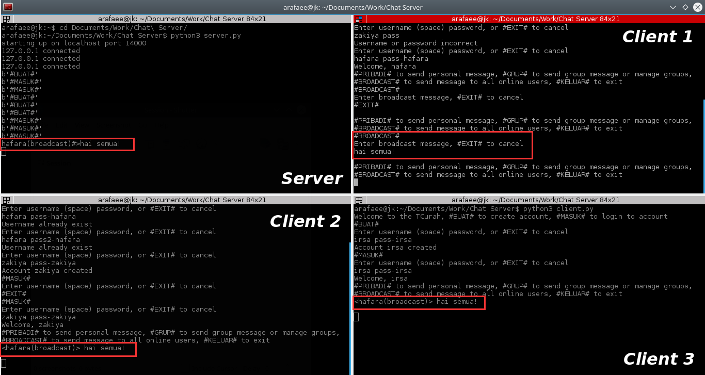

6. Fifth, we can make a group, add its members, and send a group message. First, let's say we want to create a group named "grup ciwi" that has girl members. To create a group, we use `#BUATGRUP#` command.
    
    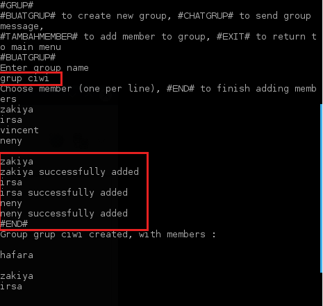

    Add a new member using `#TAMBAHMEMBER#` command.

    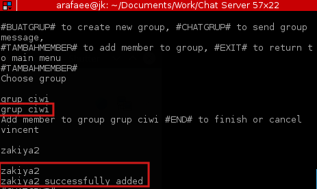

    Let's try to send a message in "grup ciwi" group using `#CHATGRUP#` command.

    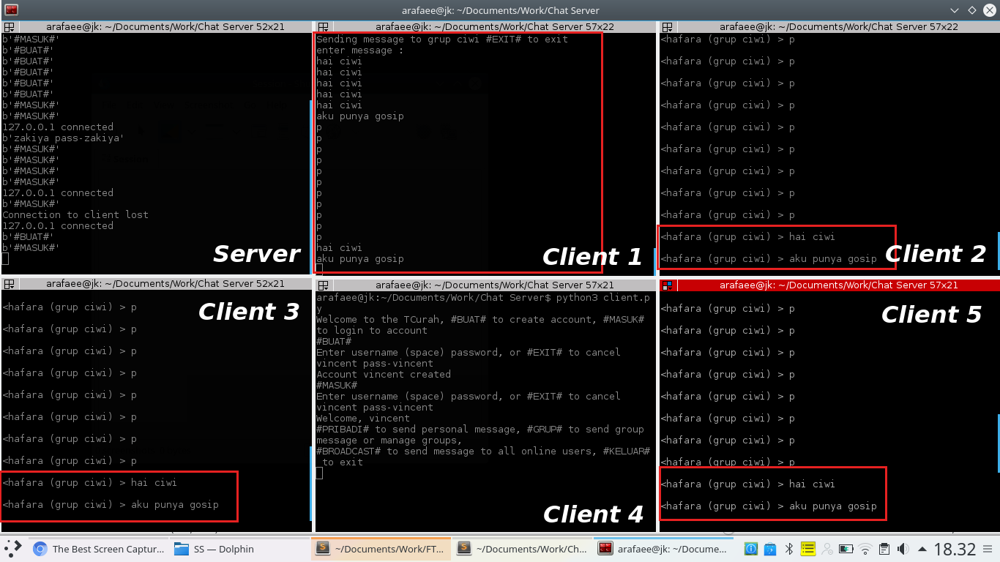

    All clients will get the messages, except client named "vincent" who is not a member because he is a boy.

7. Last, let's exit from TCurah using `#KELUAR#` command.
    
    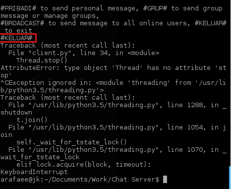
    

   

