# File Server
## Tools
1. Python 3
2. Socket 
3. Thread 
4. Asyncore for asynchronous server
5. Linux Operating System

## Description
* There are a **synchronous** server and an **asynchronous** server. The difference is when we execute something synchronously, we wait for it to finish before moving on to another task. In the other hand, when we execute something asynchronously, we can move on to another task before it finishes.
* Server has some features, i.e.:
  * Create a new directory 
  * Delete a directory 
  * Delete a file
  * Move a file or directory
  * List a directory's content
  * Upload a file
  * Download a file
  
## Testing
### synchronous server
1. Run the `sync-server.py`.
   
   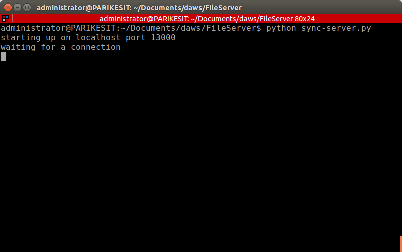

2. Create a new directory using `/createdir={directory_name}` URL.

   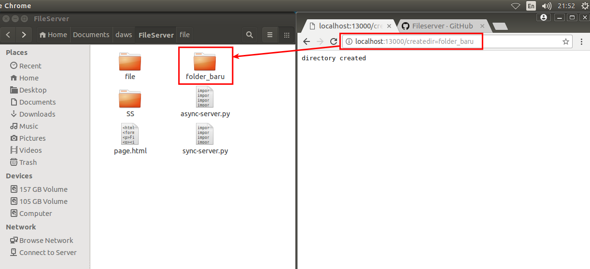

3. Delete a directory using `/deletedir={directory_name}` URL.
   
   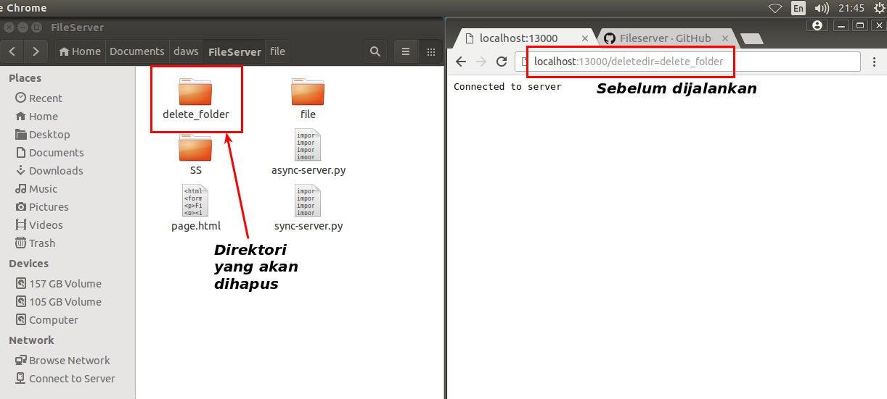

   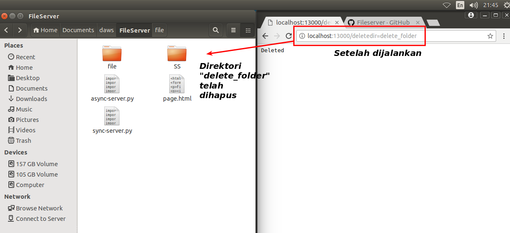

4. Delete a file using `/delete={file_name_in_the_same_level_with_server_code}` or `/delete={relative_path}/{file_name}` URL.

   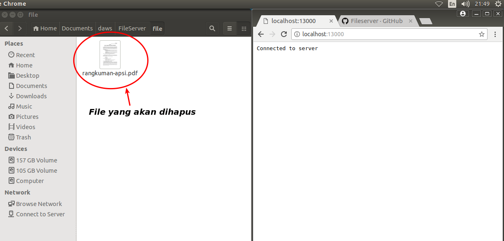

   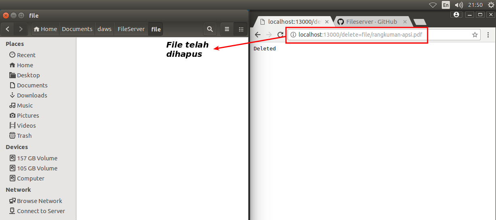

5. Move a file using `/move={source_directory}/{file_name}={destination_directory}` URL.
   
   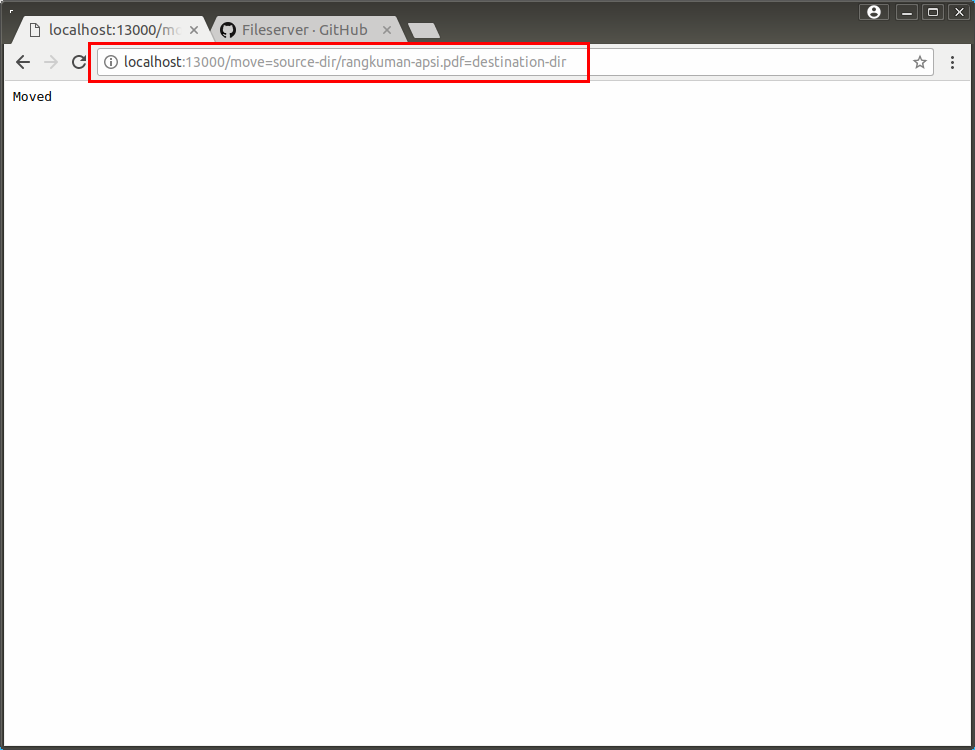

6. Move a file and rename it using `/move={{source_directory}/{file_name}={destination_directory}/{new_file_name}` URL.

   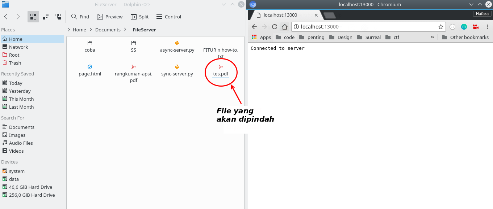

   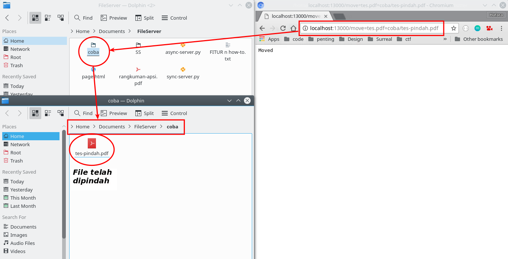

7. Move a directory using `/move={source_directory}={destination_directory}` URL.

   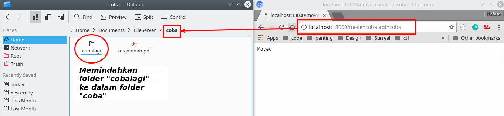

8. List the contents of a directory using `/listdir` or `/listdir/{directory_path}` URL.

   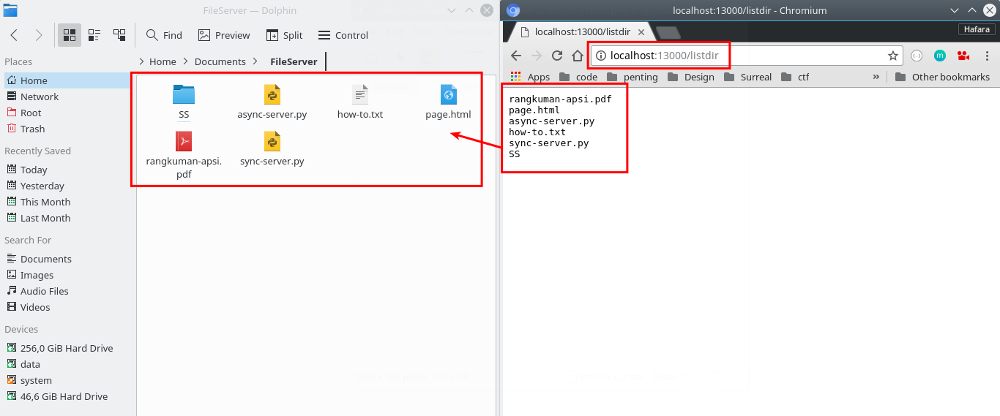

   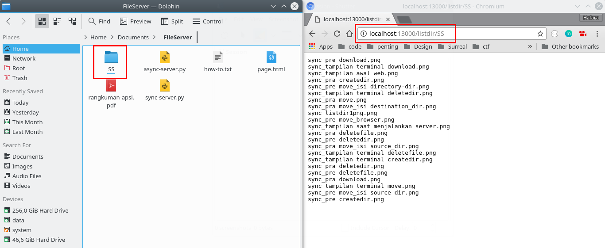

9. Upload a file using `/upload` URL to open the upload form.
    
   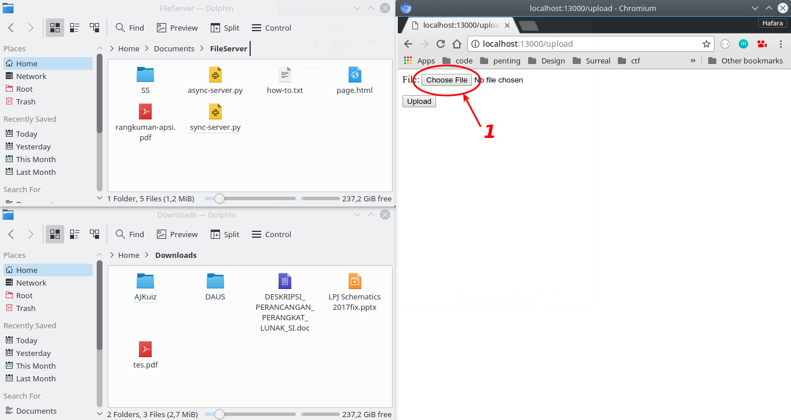

   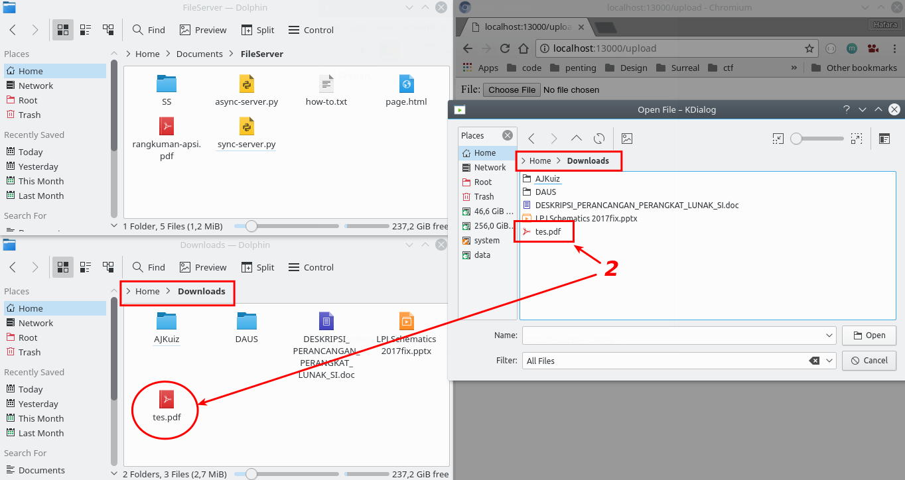

   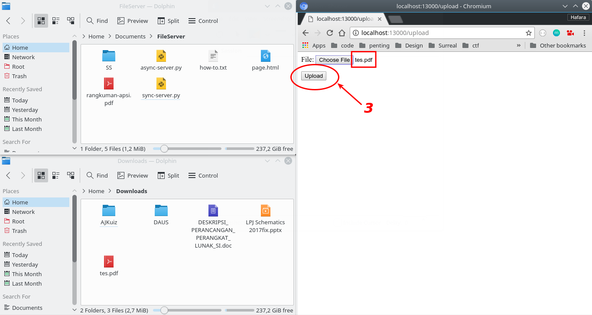

   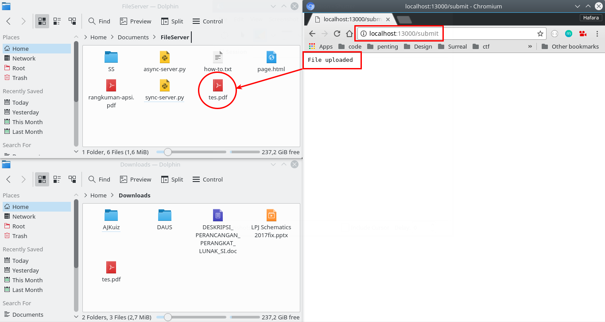

10. Last, download a file using `/download={file_name_in_the_same_level_with_server_code}` or `/download={relative_path}/{file_name}` URL.
  
   

   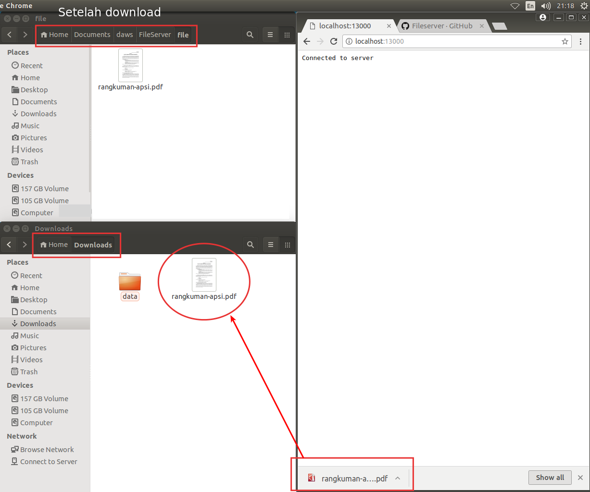

### Asynchronous server
1. Run the `async-server.py`.
2. Async-server's features and functionalities are same as the sync-server's, but it's executed asynchronously. These are some proves.
   
   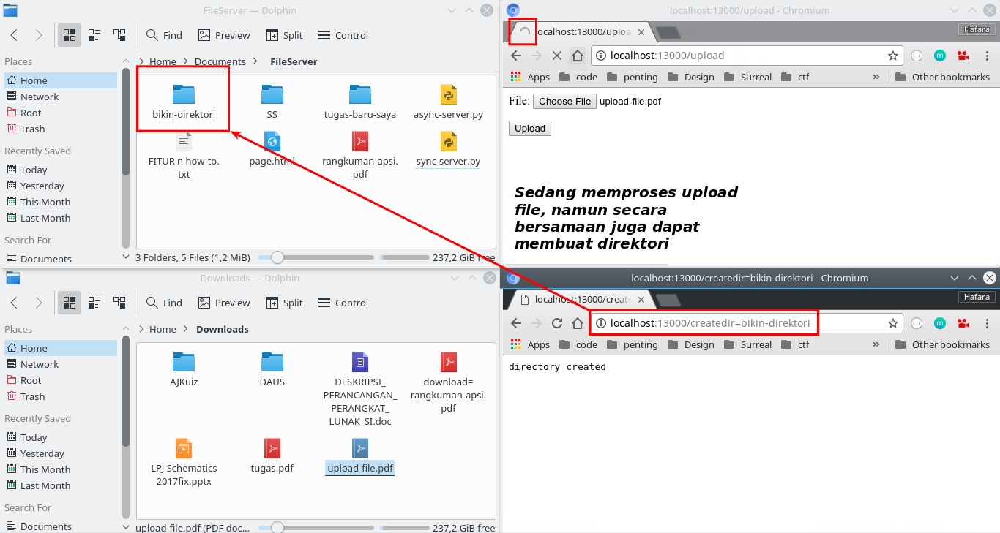

   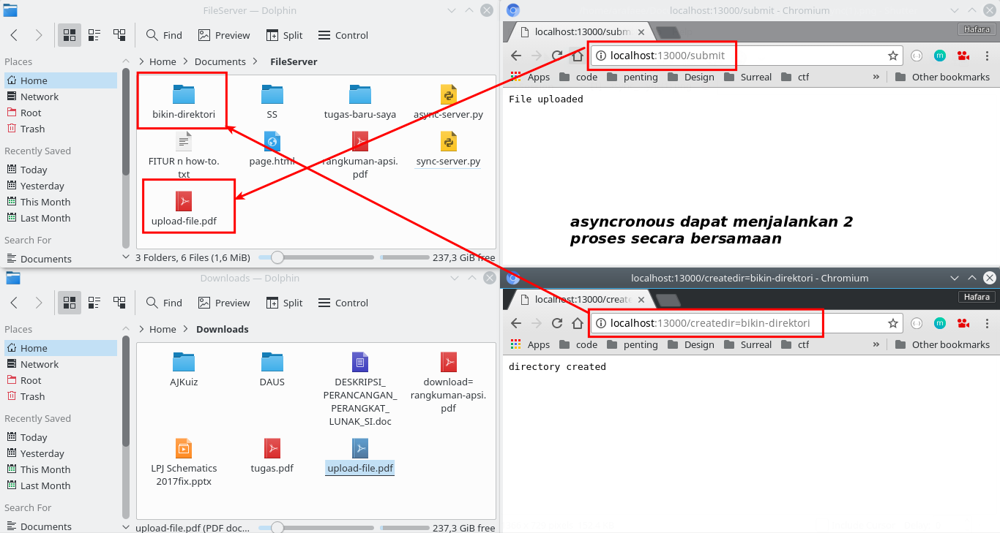

   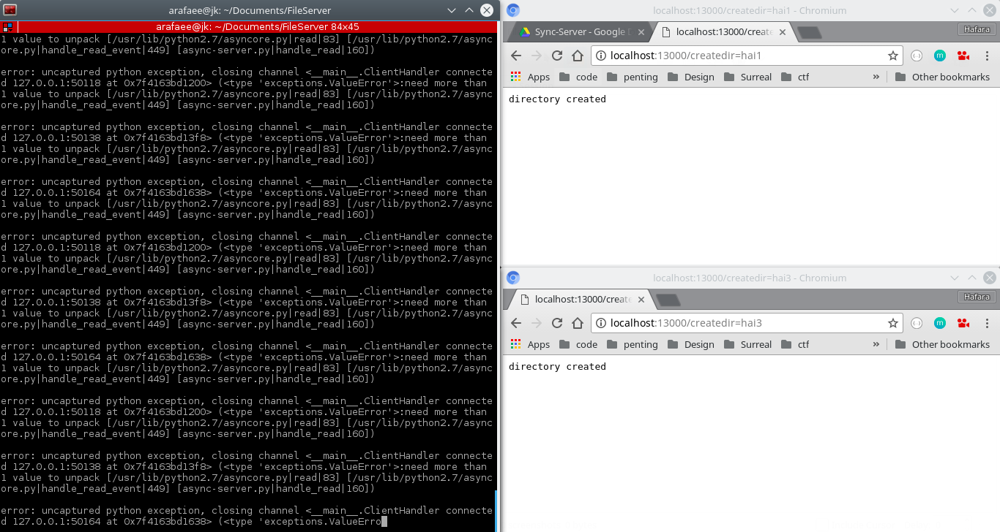

   
