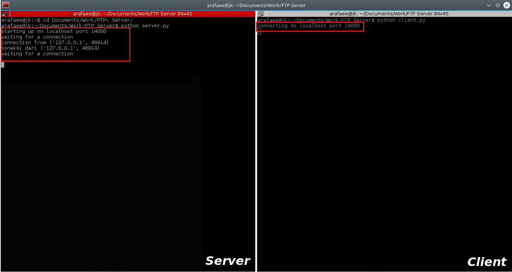
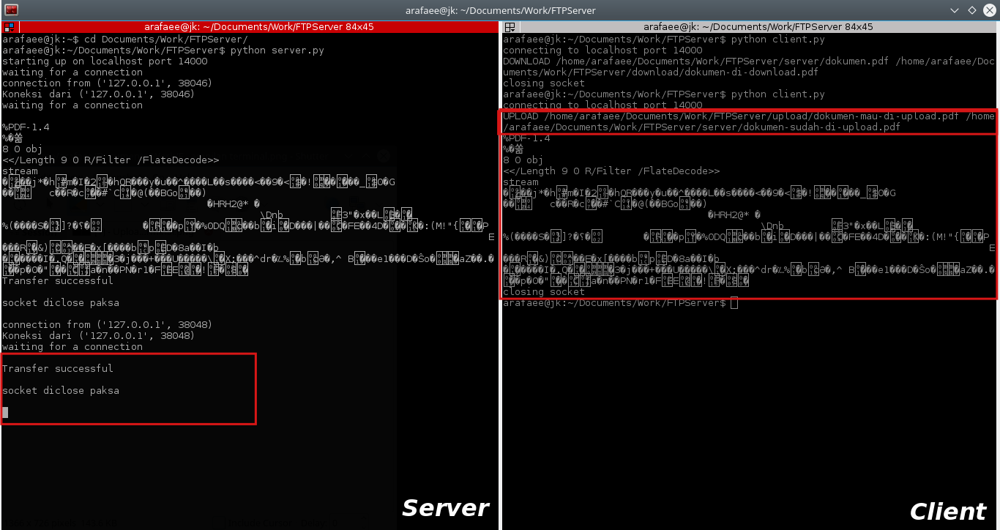
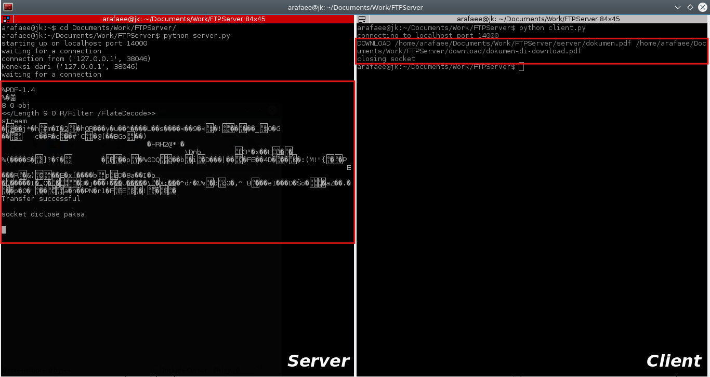
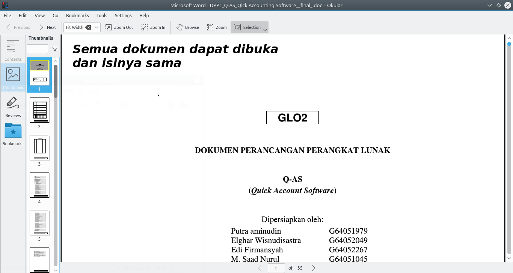

# File Transfer Protocol Server
## Tools
1. Python 3
2. Socket 
3. Thread 
4. Linux Operating System

## Description
* There are a client and a server
* Server has two main features, i.e. uploading documents and downloading documents

## Code Snippet
1. Server
   * Upload
		```python
		def proses_upload(input) :
			try :
				cmd, src_path, dest_path = input.split(" ")
				f = open(dest_path, "wb")
				data = socket_si_client.recv(512)
				while (data):
					f.write(data)
					data = socket_si_client.recv(512)
				f.close()
				return 1
			except :
				return 0
			finally :
				f.close()
		```
   * Download
		```python
		def proses_download(input) :
			try :
				cmd, src_path, dest_path = input.split(" ")
				f = open(src_path, "rb")
				data = f.read(512)
				print data
				while (data):
					socket_si_client.sendall(data)
					data = f.read(512)
				f.close()
				return 1
			except :
				return 0
			finally :
				f.close()
		```
   * Client handling
		```python
		def handle_client(socket_si_client, client_address):
			print "Koneksi dari %s \r\n" % (str(client_address))
			pesan_dari_client = ""
			while True:
				data = socket_si_client.recv(128)
				if not data:
					print "socket diclose paksa\r\n"
					break
				pesan_dari_client = pesan_dari_client + data
				if pesan_dari_client.startswith("UPLOAD"):
					hasil = proses_upload(pesan_dari_client)
					status_check(hasil)
					pesan_dari_client = ''
				elif pesan_dari_client.startswith("DOWNLOAD"):
					hasil = proses_download(pesan_dari_client)
					status_check(hasil)
					pesan_dari_client = ''
		```

2. Client
   * Upload
		```python
		if(cmd=="UPLOAD") :
			try:
				f = open(src_path, "rb")
				message = f.read(512)
				print message
				while (message):
					client_socket.send(message)
					message = f.read(512)
			finally:
				f.close()
				print >> sys.stderr, 'closing socket'
				client_socket.close()
		```
   * Download
		```python
		elif(cmd=="DOWNLOAD") :
			try:
				f = open(dest_path, "wb")
				flag = 0
				while True:
					try :
						message = client_socket.recv(512)
						while(message):
							f.write(message)
							flag = 1
							message = client_socket.recv(512)
					except :
						time.sleep(0.5)
						if (len(message) < 512 and flag == 1):
								break
			finally:
				f.close()
				print >> sys.stderr, 'closing socket'
				client_socket.close()
		```

## Testing
1. Run the `server.py` and `client.py`.
	
	

2. First, let's try to uploading a document from `/home/{user}/Documents/work/FTPServer/upload/` to `/home/{user}/Documents/work/FTPServer/server/`.
	
	

	In the client terminal, use this command:
	```
	UPLOAD /from/ /to/
	```

	

3. Second, let's try to downloading a document from `/home/{user}/Documents/work/FTPServer/server/` to `/home/{user}/Documents/work/FTPServer/download/`.
  
	

	In the client terminal, use this command:
	```
	DOWNLOAD /from/ /to/
	```

	

4. Check the document downloaded. If all documents can be opened, it means your FTP server is running properly.
   
	
